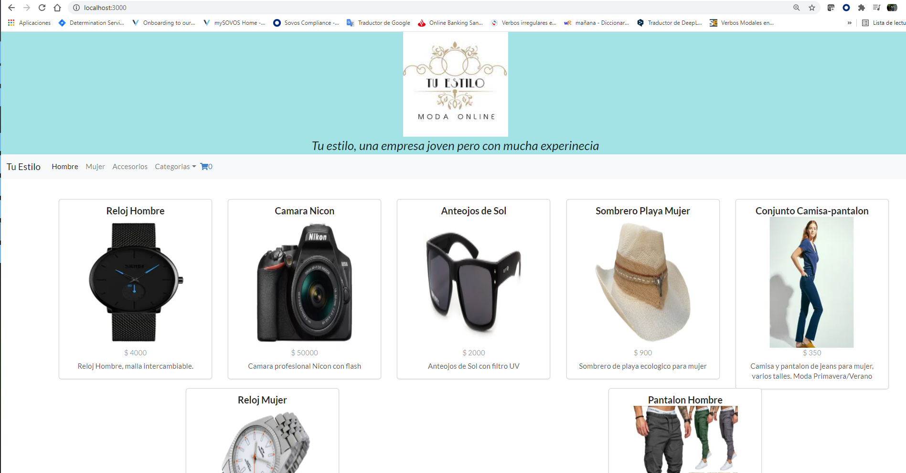
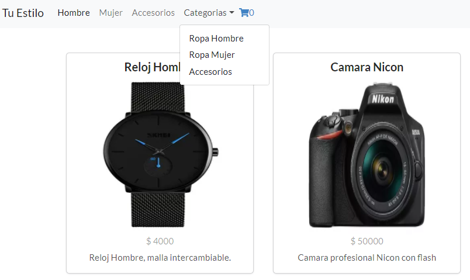
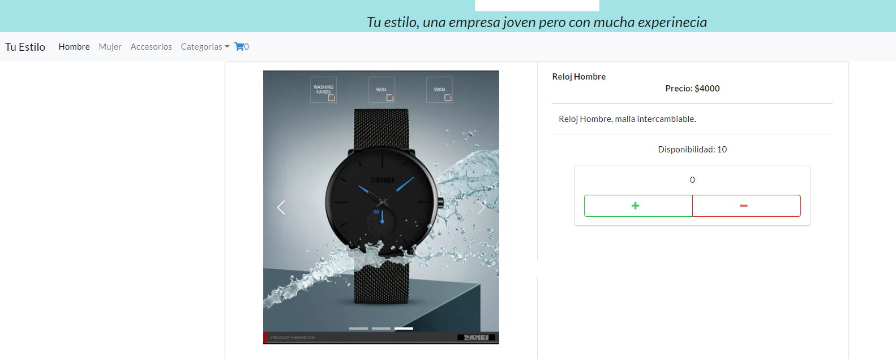
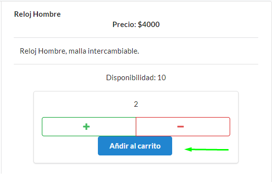
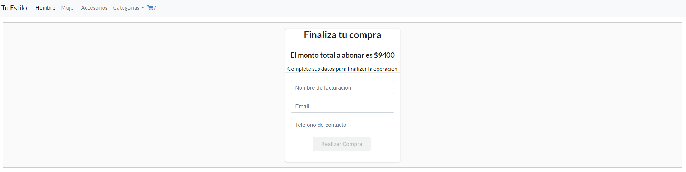

# Tu Estilo - Ecommerce

## Introduccion

En este sitio web encontraras una gran variedad de productos relacionado con la moda. Su navegabilidad es simple e intuitiva para brindarle al cliente una buena experiencia de usuario.

## Get started
Despues de clonar el ropositorio se debera instalar y correr:

### `npm install`
### `npm start`

## Home
Cuando accedemos al Home podemos encontrar todos los productos, de todas las categorias.

En la barra de navegacion encontraras todo lo relativo a categorias tanto de hombres como mujeres y el Carrito para poder realizar tu compra.

## Elegir y comprar un producto
Puedes hacer click en uno de los productos y el sitio te redireccionara a una pagina donde encontraras mas deralles del mismo y una galeria animada con mas fotos del producto.
Desde este lugar podras agregar el producto a tu carrito.

Una vez seleccionada la cantidad de productos a agregar, se habilitara un boton para agregar al carrito. 

## Cart
Una vez elegidos los productos y sus cantidades, podremos clickear en el Icono del Cart para ver su contenido.

Vemos que en el icono se puede ver la cantidad total de productos. Tambien el detalle en cada tarjeta de la cantidad de productos a comprar y el total a pagar por cada uno de ellos.
En el panel de la derecha podemos ver el total de la transaccion y podemos cancelar la compra y vaciar el carrito o terminar la compra que nos redirigiria a la parte final de la compra.

## Finalizar Compra.
Para completar el ultimo paso de la compra debemos completar un formulario y finalizarla. En ese formulario tendremos el total a abonar y al concretar la compra recibiremos un mensaje con el ID de la transaccion.

# Tu Estilo - Ecommerce te desea una satisfactoria experiencia en nuestro sitio

